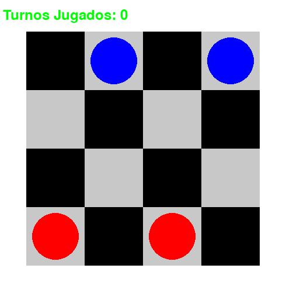

# Juego de Damas 4x4 con IA usando Minimax y Poda Alfa-Beta

Un juego de damas simplificado en un tablero 4x4, donde compites contra una IA que utiliza el algoritmo Minimax con poda alfa-beta para optimizar sus movimientos. Proyecto diseñado para evaluar la eficacia de un agente basado en conocimientos.

()

## Características
- Tablero 4x4 con configuración inicial simplificada.
- Interfaz gráfica implementada con Pygame.
- IA que utiliza el algoritmo Minimax con poda alfa-beta (profundidad ajustable).
- Sistema de coronación de reinas al llegar a la última fila.
- Contador de turnos y detección automática de fin del juego.
- Movimientos válidos resaltados al seleccionar una pieza.

## Requisitos
- Python 3.7 o superior
- Pygame 2.0 o superior

## Instalación
1. Clona el repositorio:
   ```bash
   git clone git@github.com:HenryNavarro1998/ia_project_1.git
   cd ia_project_1
   ```

2. Instala las dependencias:
   ```bash
   pip install pygame
   ```

## Ejecución
```bash
python main.py
```

## Controles
- **Clic izquierdo**: Seleccionar/mover pieza.
- **Turno humano (X)**: Selecciona tus piezas (azules) y haz clic en una casilla verde para mover.
- **Turno IA (O)**: Juega automáticamente después de tu movimiento.
- El juego termina cuando un jugador pierde todas sus piezas o no tiene movimientos válidos.

## Estructura del Proyecto
| Archivo      | Descripción                                                                 |
|--------------|-----------------------------------------------------------------------------|
| `main.py`    | Script principal - maneja la lógica del juego y eventos de Pygame.         |
| `minimax.py` | Implementación del algoritmo Minimax con poda alfa-beta.                   |
| `utils.py`   | Funciones auxiliares (tablero, movimientos, validaciones).                 |
| `layout.py`  | Renderizado gráfico del tablero y manejo de interacciones.                 |

## Detalles Técnicos
- **Profundidad de búsqueda**: La IA utiliza una profundidad de 3 por defecto (modificable en `main.py`).
- **Función de evaluación**: Diferencia entre cantidad de piezas de cada jugador.
- **Optimizaciones**: Ordenamiento de movimientos para mejorar eficiencia de la poda.

## Solución de Problemas
- **Error al importar Pygame**: Asegúrate de haberlo instalado correctamente con `pip install pygame`.
- **Ventana no responde**: El juego tiene un límite de 64 turnos para prevenir bucles infinitos.
- **Movimientos inválidos**: Solo se permiten movimientos diagonales y capturas según reglas de damas.